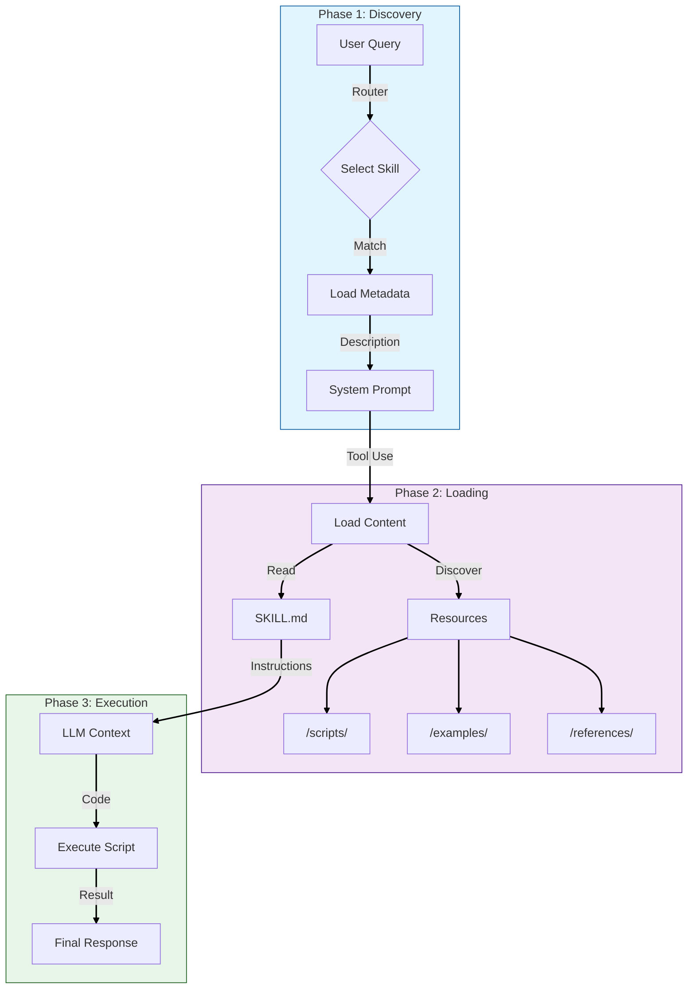

# LLM Skills


A Python SDK for building **AI Agent Skills** that strictly follow the official [Anthropic `SKILL.md` standard](https://platform.claude.com/docs/en/agents-and-tools/agent-skills/overview).

Designed to be the standard implementation for **modular AI tooling**, this SDK enables developers to build portable, secure, and highly capable skills for **Claude**, **OpenAI**, and other LLMs with function calling support. It handles validation, discovery, and progressive loading, so you can focus on building intelligent capabilities.

## Why LLM Skills?

Building agentic tools today is often messy and inefficient. Developers face three core problems:

1.  **Token Bloat**: Injecting every possible tool definition into the system prompt exhausts context windows and increases cost.
2.  **Vendor Lock-in**: Tools written for OpenAI function calling often don't work with Claude or other models without significant rewriting.
3.  **Spaghetti Code**: Hard-coding tool logic directly into your agent making it impossible to share or reuse capabilities across projects.

**LLM Skills solves this by treating skills as portable data packages.**
- **Standardized**: Write once using `SKILL.md` and run anywhere (OpenAI, Claude, Custom Agents).
- **Efficient**: Uses *Progressive Disclosure* to load heavy instructions and scripts only when the model actually decides to use the skill.
- **Discoverable**: The built-in Router allows your agent to choose from hundreds of skills dynamically, rather than being limited to a static set of tools.

## How It Works

The SDK implements the **Anthropic 4-Phase Loading** architecture to optimize token usage and context management:



## Features

- **Standard Compliance**: Validates `SKILL.md` against official Anthropic rules (name format, length limits) to ensure compatibility with the Claude API.
- **Progressive Disclosure**: Efficiently manages token context by loading only essential metadata initially, then pulling in full instructions and companion resources (like scripts or reference docs) only when the skill is actually used.
- **Auto-Discovery**: Automatically finds and categorizes companion files (`scripts/`, `examples/`, `references/`) within skill directories, making them available to your agent.
- **Secure by Default**: Built-in path traversal protection ensures skills cannot access files outside their directory.
- **Universal Patterns**:
  - **Prompt Injection**: Use `Patterns.file_based_prompt` to inject skill instructions directly into your system prompt.
  - **Function Calling**: Use `to_tool_definition()` to generate JSON schemas for OpenAI or Claude tool use.
  - **Native Anthropic**: Use `to_anthropic_files()` to bundle and upload skills directly to the Anthropic API for containerized execution.

## Supported Agent Formats

The SDK is **Polyglot** and can natively read skills from your favorite agent frameworks without modification:

- **Claude**: `.claude/skills/**/SKILL.md` (and generic `Skills/` directories)
- **Cursor**: `.cursor/rules/*.mdc` (Automatically parses frontmatter and globs)
- **GitHub Copilot**: `.github/skills/*.md`

Just point the `SkillRegistry` to your repository root, and it will auto-discover all supported formats:

```python
registry.auto_discover("/path/to/my-repo")
```


## Installation

We recommend using `uv` for modern Python project management.

### Quick Install (Recommended)
Installs the core library plus **OpenAI** and **Anthropic** support.

```bash
uv add "py-llm-skills[full]"
```

### Lite Install (Core Only)
Installs only the lightweight core. Useful if you want to bring your own LLM client.

```bash
uv add py-llm-skills
```

### Specific Features
You can also mix and match optional dependencies:

```bash
uv add "py-llm-skills[openai]"    # Adds OpenAI SDK
uv add "py-llm-skills[anthropic]" # Adds Anthropic SDK
```

### Pip Users
If you are using standard `pip`:

```bash
pip install "py-llm-skills[full]"
```

## Quick Start

### 1. Define a Skill
Create a directory `skills/weather/` and add a `SKILL.md`. Notice how we key-value pair metadata for the router and keep instructions clear.

```markdown
---
name: weather
description: Get current weather information for a given location.
version: 1.0.0
input_schema:
  type: object
  properties:
    location: {type: string, description: "City and state, e.g. San Francisco, CA"}
  required: [location]
---
You are a weather assistant. Fetch real-time data for the user's location.
```

### 2. Use in Python

```python
from py_llm_skills import SkillRegistry, Skill, Patterns

# Load all skills from a directory
registry = SkillRegistry()
registry.register_directory("./skills")

# Get a specific skill by name
weather = registry.get_skill("weather")

# Pattern 1: Inject into system prompt
prompt = Patterns.file_based_prompt([weather])

# Pattern 2: Use as OpenAI / Claude tool
tool_def = weather.to_tool_definition()

# Pattern 3: Upload to Anthropic Skills API
# This bundles the SKILL.md and all discovered scripts/resources
files = weather.to_anthropic_files()
```


### 4. Structured Output
Use Pydantic models to get type-safe, structured responses from your LLM (OpenAI/Anthropic).

```python
from pydantic import BaseModel
from py_llm_skills.llm.openai import OpenAISDKAdapter

class AnalysisResult(BaseModel):
    summary: str
    sentiment: float
    tags: list[str]

# ... initialize client ...
result = client.chat_completion_with_structure(
    messages=[{"role": "user", "content": "Analyze this..."}], 
    response_model=AnalysisResult
)
print(result.summary)
```

### 5. Upload to Claude (Anthropic Skills API)

Directly upload your local skills to the Anthropic beta API for server-side execution:

```python
import anthropic
from py_llm_skills.llm.claude import AnthropicSkillManager

client = anthropic.Anthropic()
manager = AnthropicSkillManager(client)

# Upload a skill and get a skill_id
skill_id = manager.upload_skill(weather)

# Use in messages via the container parameter
container = manager.format_container_param([skill_id])
```

## Skill Collections
Looking for pre-built skills? Check out these awesome community repositories:

- [ComposioHQ/awesome-claude-skills](https://github.com/ComposioHQ/awesome-claude-skills) - A curated list of Claude-specific skills.
- [heilcheng/awesome-agent-skills](https://github.com/heilcheng/awesome-agent-skills) - Broad collection of skills for various agent frameworks.
- [github/awesome-copilot](https://github.com/github/awesome-copilot) - Useful extensions and tools that can be adapted as skills.

## Contributing

We welcome contributions! Please see [CONTRIBUTING.md](CONTRIBUTING.md) for details on how to set up your development environment and submit pull requests.

## License

MIT
